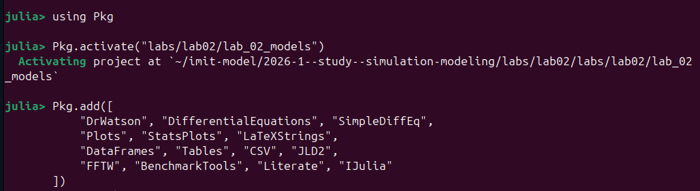
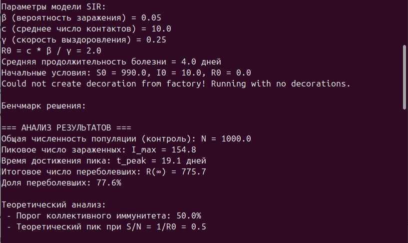
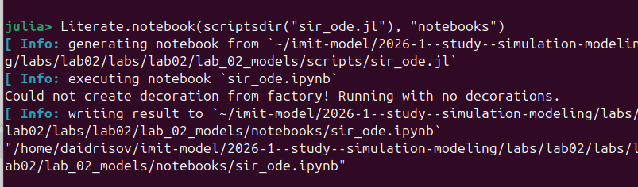

---
## Author
author:
  name: Идрисов Джафер Арсенович
  degrees: student
  email: 1132232876@rudn.ru
  affiliation:
    - name: Российский университет дружбы народов
      country: Российская Федерация
      postal-code: 117198
      city: Москва
      address: ул. Миклухо-Маклая, д. 6
## Title
title: Лабораторная работа №2
subtitle: Имитационное моделирование
license: CC BY
date: today
date-format: "YYYY-MM-DD"
---

# Информация

## Докладчик

:::::::::::::: {.columns align=center}
::: {.column width="70%"}

  * Идрисов Джафер Арсенович
  * студент
  * Российский университет дружбы народов
  * [1132232876@rudn.ru](mailto:1132232876@rudn.ru)

:::
::::::::::::::

# Вводная часть

## Цель работы

Освоить методологию **литературного программирования** (Literate Programming) для создания воспроизводимых имитационных моделей:

- реализовать модели **SIR** и **Лотки--Вольтерры** на языке Julia;
- преобразовать рабочие скрипты в литературный стиль с разметкой **Literate.jl**;
- сгенерировать производные форматы и интегрировать документацию в отчёт.

## Задачи

- Создать проект DrWatson `lab_02_models` с необходимыми зависимостями
- Выполнить предложенные скрипты моделей SIR и Лотки--Вольтерры
- Преобразовать код в литературный стиль
- Сгенерировать производные форматы: `.jl`, `.ipynb`, `.md`
- Выполнить Jupyter notebooks через `nbconvert --execute`
- Добавить анализ чувствительности, перегенерировать форматы
- Интегрировать Quarto-документацию в отчёт

## Литературное программирование

:::::::::::::: {.columns}
::: {.column width="50%"}

**Один источник $\to$ три формата:**

- Чистый скрипт `.jl`
- Jupyter notebook `.ipynb`
- Quarto-документация `.qmd`

Идея Д. Кнута (1984): программа --- связный текст для людей, в котором код сопровождён пояснениями.

:::
::: {.column width="50%"}

**Разметка Literate.jl:**

```julia
# # Заголовок
# Текст параграфа с $формулами$
#jl  # только в скрипте
#nb  # только в ноутбуке
#src # скрыто из всего
```

:::
::::::::::::::

# Теоретическое введение

## Модель SIR --- система уравнений

$$\frac{dS}{dt} = -\frac{\beta c}{N} I S, \quad
  \frac{dI}{dt} = \frac{\beta c}{N} I S - \gamma I, \quad
  \frac{dR}{dt} = \gamma I$$

| Параметр | Значение | Смысл |
|----------|----------|-------|
| $\beta$  | 0.05 | вероятность заражения при контакте |
| $c$      | 10 | контактов в сутки |
| $\gamma$ | 0.25 | скорость выздоровления ($1/\gamma = 4$ дня) |

$$R_0 = \frac{\beta c}{\gamma} = 2.0$$

Если $R_0 > 1$ --- эпидемия распространяется; порог иммунитета: $1 - 1/R_0$

## Модель Лотки--Вольтерры --- система уравнений

$$\frac{dx}{dt} = \alpha x - \beta x y, \quad
  \frac{dy}{dt} = \delta x y - \gamma y$$

| Параметр | Значение | Смысл |
|----------|----------|-------|
| $\alpha$ | 0.1 | прирост жертв |
| $\beta$  | 0.02 | выедание жертв хищниками |
| $\delta$ | 0.01 | конверсия жертв в хищников |
| $\gamma$ | 0.3 | смертность хищников |

Нетривиальное равновесие: $x^* = \gamma/\delta = 30$, $y^* = \alpha/\beta = 5$

Период колебаний: $T = 2\pi / \sqrt{\alpha\gamma}$

# Выполнение лабораторной работы

## Запуск Julia и подключение DrWatson


Julia 1.12.5 запущена, пакет DrWatson предварительно скомпилирован

## Создание проекта DrWatson


`initialize_project("labs/lab02/lab_02_models"; authors="Идрисов Джафер")`

DrWatson создаёт стандартную структуру: `scripts/`, `plots/`, `data/`, `notebooks/`, `docs/`

## Установка Julia-пакетов



Добавлены DifferentialEquations, Plots, DataFrames, FFTW, Literate, IJulia и другие

## Результаты модели SIR



- $R_0 = 2.0$ --- эпидемия распространяется
- $I_{\max} = 154.8$ чел. на $t = 19.1$ день
- Переболели 77.6\% популяции ($R(\infty) = 775.7$)
- Порог коллективного иммунитета: 50\%

## SIR: сводная панель графиков


Шесть подграфиков: $S(t)$, $I(t)$, $R(t)$, логарифмическая шкала, фазовый портрет, $R_e(t)$

## SIR: динамика эпидемии


Колоколообразная кривая $I(t)$, S-образный рост $R(t)$, монотонный спад $S(t)$

## SIR: фазовый портрет и $R_e(t)$

:::::::::::::: {.columns}
::: {.column width="50%"}


:::
::: {.column width="50%"}


:::
::::::::::::::

## Результаты модели Лотки--Вольтерры


- $x^* = 30.0$, $y^* = 5.0$
- Частота колебаний: 0.2499 Гц, период $T \approx 4.0$
- Сдвиг фаз (хищники отстают): $-30.8$

## LV: сводная панель графиков


Динамика, фазовый портрет, производные, спектр FFT, относительные изменения

## LV: динамика популяций и фазовый портрет

:::::::::::::: {.columns}
::: {.column width="50%"}


:::
::: {.column width="50%"}


:::
::::::::::::::

Замкнутая орбита подтверждает консервативность системы

## Генерация Markdown-документации


`Literate.markdown(scriptsdir("sir_ode.jl"), "docs")` --- комментарии $\to$ Markdown, код $\to$ блоки кода

## Генерация Jupyter Notebooks

:::::::::::::: {.columns}
::: {.column width="50%"}



:::
::: {.column width="50%"}


:::
::::::::::::::

`Literate.notebook()` --- текст $\to$ Markdown-ячейки, код $\to$ кодовые ячейки

## Выполнение ноутбуков


`jupyter nbconvert --to notebook --execute --inplace` для обоих ноутбуков

## Ноутбуки выполнены успешно


- `lv_ode.ipynb`: 2 194 343 байта
- `sir_ode.ipynb`: 2 847 355 байт

## Перегенерация после анализа чувствительности


Добавлены разделы анализа чувствительности, документация обновлена

# Результаты

## Ключевые числовые результаты

**Модель SIR** ($\beta = 0.05$, $c = 10$, $\gamma = 0.25$):

- $R_0 = 2.0$, пик $I_{\max} = 154.8$ (день 19.1), охват 77.6\%
- При $R_0 < 1$ эпидемия не разворачивается
- При $R_0 = 4$ переболевают $> 95\%$

**Модель Лотки--Вольтерры** ($\alpha = 0.1$, $\beta = 0.02$, $\delta = 0.01$, $\gamma = 0.3$):

- Равновесие $(30, 5)$, период $T \approx 4.0$
- Замкнутые орбиты на фазовом портрете, подтверждено FFT
- Изменение параметров сдвигает равновесие, но орбиты остаются замкнутыми

## Выводы

- Создан проект DrWatson `lab_02_models` с полным набором зависимостей
- Реализованы и верифицированы модели **SIR** и **Лотки--Вольтерры**
- Код преобразован в **литературный стиль** с разметкой Literate.jl
- Из одного файла сгенерированы три формата: `.jl`, `.ipynb`, `.md`
- Ноутбуки выполнены через `jupyter nbconvert --execute`
- Добавлен **анализ чувствительности**, форматы перегенерированы
- Quarto-документация интегрирована в академический отчёт

