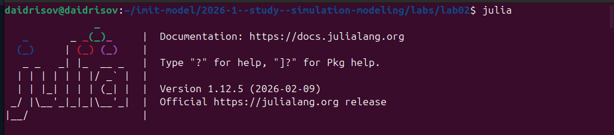
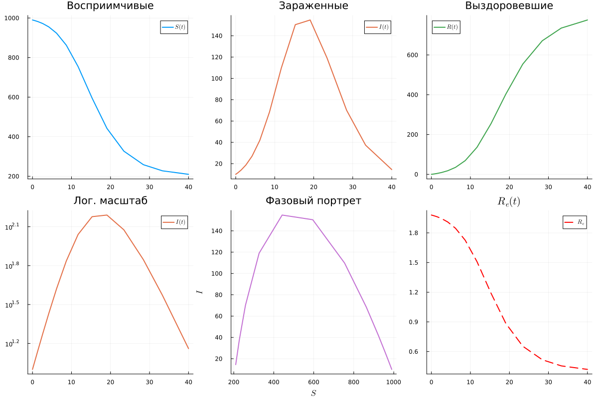
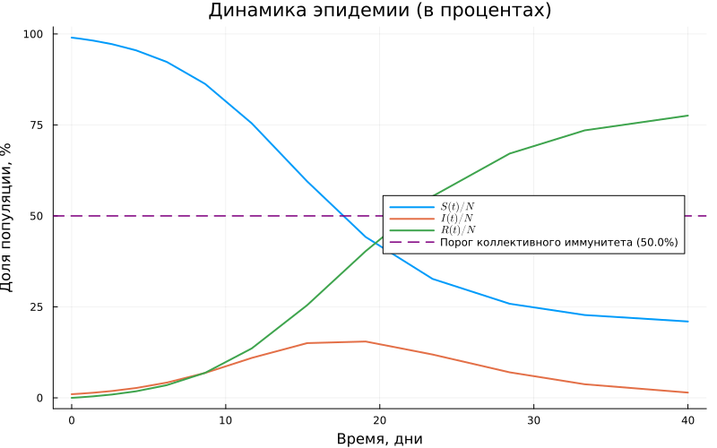
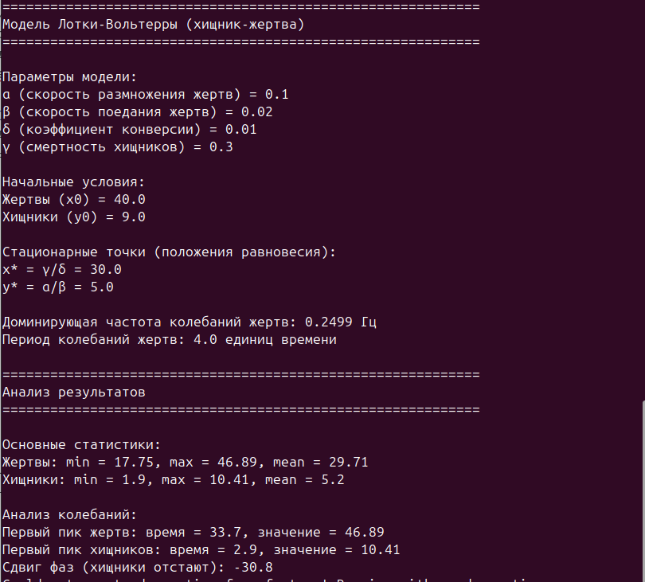
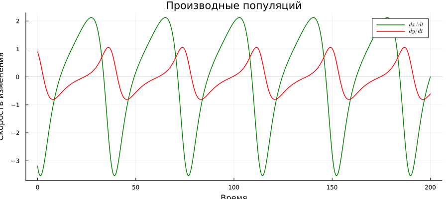
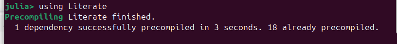

---
## Author
author:
  name: Идрисов Джафер Арсенович
  degrees: student
  email: 1132232876@rudn.ru
  affiliation:
    - name: Российский университет дружбы народов
      country: Российская Федерация
      postal-code: 117198
      city: Москва
      address: ул. Миклухо-Маклая, д. 6

## Title
title: "Имитационное моделирование"
subtitle: "Лабораторная работа №2"
license: "CC BY"
---

# Цель работы

Освоить методологию литературного программирования (Literate Programming) и применить её при реализации двух классических имитационных моделей --- эпидемиологической модели SIR и экологической модели Лотки--Вольтерры --- на языке Julia. В ходе работы необходимо научиться создавать литературные скрипты, из которых автоматически генерируются производные форматы (чистый код, Jupyter-блокнот, Quarto-документация), а также интегрировать полученную документацию в академический отчёт.

# Задание

1. Создать рабочий каталог проекта DrWatson для размещения кода моделей.
2. Установить необходимые Julia-пакеты (DifferentialEquations, Plots, Literate и др.).
3. Выполнить предложенные скрипты моделей SIR и Лотки--Вольтерры, верифицировать результаты.
4. Преобразовать рабочий код в литературный стиль с разметкой Literate.jl.
5. Сгенерировать из литературного кода три производных формата: чистый `.jl`-скрипт, Jupyter notebook `.ipynb`, Quarto-документацию `.qmd`.
6. Выполнить код из Jupyter notebook и убедиться в корректности результатов.
7. Интегрировать Quarto-документацию в настоящий отчёт.
8. Добавить в литературный код раздел с анализом чувствительности (вычисление для набора параметров).
9. Перегенерировать производные форматы из обновлённого литературного кода.
10. Выполнить обновлённые Jupyter notebooks.
11. Интегрировать обновлённую документацию с анализом чувствительности в отчёт.

# Теоретическое введение

## Литературное программирование

Концепция литературного программирования была впервые сформулирована Дональдом Кнутом в 1984 году [@knuth_1984]. Центральная идея состоит в том, что исходный код программы должен быть организован не столько для удобства компилятора, сколько для восприятия человеком. Программа рассматривается как связный текст, в котором алгоритмические решения сопровождаются развёрнутыми пояснениями на естественном языке.

Для воспроизводимых научных вычислений данный подход был детально проработан в [@schulte_2012]. В экосистеме Julia литературное программирование реализуется посредством пакета Literate.jl. Единственный `.jl`-файл с определённой системой комментариев служит источником сразу трёх производных форматов:

- **чистый Julia-скрипт** --- `.jl` без документационных комментариев, пригодный для прямого запуска;
- **Jupyter notebook** --- интерактивный блокнот `.ipynb`, удобный для исследовательской работы [@kery_2018];
- **Quarto-документ** --- `.qmd`-файл, из которого рендерится PDF, HTML или DOCX.

Разметка Literate.jl использует следующие конструкции:

| Синтаксис | Назначение |
|-----------|------------|
| `# # Заголовок` | Заголовок уровня 1 в Markdown |
| `# Текст` | Обычный текстовый параграф |
| `#jl код` | Код включается только в чистый `.jl`-скрипт |
| `#nb код` | Код включается только в `.ipynb`-ноутбук |
| `#src код` | Код скрыт из всех выходных форматов |

: Основные элементы разметки Literate.jl {#tbl-literate-syntax}

## Модель SIR

Модель SIR представляет собой классическую компартментальную модель эпидемиологии, описывающую распространение инфекционного заболевания в закрытой однородной популяции [@kermack_1927; @hethcote_2000]. Всё население разбивается на три взаимосвязанные группы:

- **S** (*Susceptible*) --- восприимчивые индивиды, не имеющие иммунитета и способные заразиться;
- **I** (*Infectious*) --- инфицированные, которые в данный момент больны и передают инфекцию;
- **R** (*Recovered*) --- выздоровевшие, приобретшие стойкий иммунитет и вышедшие из процесса передачи.

Модель опирается на ряд ключевых допущений: закрытая популяция ($N = S + I + R = \text{const}$, без рождений и смертей), однородное смешение (каждый восприимчивый одинаково рискует встретиться с заразным), постоянство параметров заразности и выздоровления, отсутствие латентного периода, а также пожизненный иммунитет после выздоровления.

Динамика модели описывается системой обыкновенных дифференциальных уравнений. В трёхпараметрической формулировке коэффициент заражения разделяется на два компонента --- вероятность передачи инфекции при контакте $\beta$ и среднее число контактов в единицу времени $c$:

$$\frac{dS}{dt} = -\frac{\beta c}{N}\, I \cdot S$$ {#eq-sir-s}

$$\frac{dI}{dt} = \frac{\beta c}{N}\, I \cdot S - \gamma I$$ {#eq-sir-i}

$$\frac{dR}{dt} = \gamma I$$ {#eq-sir-r}

Ключевым показателем модели является базовое репродуктивное число $R_0$, определяющее среднее количество вторичных случаев заражения от одного инфицированного в полностью восприимчивой популяции:

$$R_0 = \frac{\beta \cdot c}{\gamma}$$ {#eq-r0}

При $R_0 > 1$ эпидемия разрастается, при $R_0 < 1$ --- самопроизвольно угасает. Эффективное репродуктивное число $R_e = R_0 \cdot (S/N)$ учитывает текущую долю восприимчивых и позволяет отслеживать момент перехода эпидемии в фазу спада (когда $R_e$ опускается ниже единицы). Порог коллективного иммунитета равен $1 - 1/R_0$.

Параметры, использованные при моделировании, приведены в [табл. @tbl-sir-params].

| Параметр | Значение | Смысл |
|----------|----------|-------|
| $\beta$ | 0.05 | вероятность заражения при одном контакте |
| $c$ | 10 | среднее число контактов в сутки |
| $\gamma$ | 0.25 | скорость выздоровления ($1/\gamma = 4$ дня) |
| $N$ | 1000 | численность популяции |

: Параметры трёхпараметрической модели SIR {#tbl-sir-params}

## Модель Лотки--Вольтерры

Модель Лотки--Вольтерры --- фундаментальная экологическая модель, описывающая динамику взаимодействия двух популяций: жертв ($x$) и хищников ($y$). Она была независимо предложена Альфредом Лоткой в 1925 году для химических реакций [@lotka_1925] и Витторио Вольтеррой в 1928 году для объяснения колебаний улова рыбы в Адриатическом море [@volterra_1928].

Модель строится на нескольких упрощающих предположениях: закрытая система (нет миграции), неограниченные ресурсы для жертв в отсутствие хищников, линейная функциональная реакция (вероятность встречи пропорциональна произведению численностей), постоянство коэффициентов взаимодействия, отсутствие внутривидовой конкуренции.

Система ОДУ модели записывается следующим образом:

$$\frac{dx}{dt} = \alpha x - \beta x y$$ {#eq-lv-x}

$$\frac{dy}{dt} = \delta x y - \gamma y$$ {#eq-lv-y}

Параметры модели представлены в [табл. @tbl-lv-params].

| Параметр | Значение | Биологический смысл |
|----------|----------|---------------------|
| $\alpha$ | 0.1 | скорость естественного прироста жертв |
| $\beta$ | 0.02 | интенсивность выедания жертв хищниками |
| $\delta$ | 0.01 | коэффициент конверсии жертв в прирост хищников |
| $\gamma$ | 0.3 | естественная смертность хищников |

: Параметры модели Лотки--Вольтерры {#tbl-lv-params}

Система имеет два положения равновесия: тривиальное $(0, 0)$ (вымирание обоих видов) и нетривиальное $\bigl(x^* = \gamma/\delta,\; y^* = \alpha/\beta\bigr)$, вокруг которого траектории образуют замкнутые орбиты --- характерную черту консервативной системы. Теоретический период малых колебаний вблизи равновесия вычисляется по формуле $T = 2\pi / \sqrt{\alpha\gamma}$.

Для численного интегрирования обеих моделей использовалась библиотека DifferentialEquations.jl [@rackauckas_2017], реализованная на языке Julia [@bezanson_2017].

# Выполнение лабораторной работы

## Шаг 1. Запуск Julia и загрузка DrWatson

Первым делом запускаем интерпретатор Julia. На [рис. @fig-julia] представлено окно REPL с информацией о версии --- Julia 1.12.5.

{#fig-julia width=90%}

Далее подключаем пакет DrWatson, предназначенный для организации воспроизводимых научных вычислений. DrWatson предоставляет удобные функции навигации по каталогам проекта (`plotsdir()`, `datadir()`, `scriptsdir()`), а также механизм автоматической активации проектного окружения. На [рис. @fig-drwatson] видно, что пакет успешно прекомпилирован: 18 зависимостей скомпилированы за 44 секунды, ещё 27 уже были готовы.

{#fig-drwatson width=90%}

## Шаг 2. Создание проекта DrWatson

Вызываем функцию `initialize_project` для создания стандартной структуры каталогов научного проекта ([рис. @fig-init-proj]). Команда:

```julia
initialize_project("labs/lab02/lab_02_models"; authors="Идрисов Джафер")
```

DrWatson автоматически создаёт каталоги `scripts/`, `src/`, `data/`, `plots/`, `notebooks/`, `docs/`, `test/`, а также файлы `Project.toml` и `Manifest.toml` для управления зависимостями. На скриншоте видно, что проект активирован по указанному пути, установлен пакет `Preferences v1.5.2` и сам `DrWatson v2.19.1` добавлен в зависимости.

{#fig-init-proj width=90%}

## Шаг 3. Установка зависимостей

Активируем проектное окружение и добавляем необходимые пакеты через менеджер `Pkg` ([рис. @fig-pkg-add]):

```julia
using Pkg
Pkg.activate("labs/lab02/lab_02_models")
Pkg.add([
    "DrWatson", "DifferentialEquations", "SimpleDiffEq",
    "Plots", "StatsPlots", "LaTeXStrings",
    "DataFrames", "Tables", "CSV", "JLD2",
    "FFTW", "BenchmarkTools", "Literate", "IJulia"
])
```

Ключевые пакеты и их назначение:

- `DifferentialEquations` --- мощная библиотека солверов для ОДУ, ДАУ, СДУ и других типов уравнений;
- `Plots` и `StatsPlots` --- построение графиков с поддержкой множества бэкендов;
- `DataFrames` --- табличная обработка данных, аналог pandas в Python;
- `FFTW` --- быстрое преобразование Фурье для спектрального анализа;
- `Literate` --- пакет литературного программирования для генерации производных форматов;
- `IJulia` --- ядро Julia для Jupyter, обеспечивающее работу ноутбуков.

Все зависимости фиксируются в `Project.toml`, что гарантирует воспроизводимость: любой пользователь сможет восстановить окружение командой `Pkg.instantiate()`.

{#fig-pkg-add width=90%}

## Шаг 4. Запуск модели SIR

Выполняем скрипт `sir_ode.jl` командой `include("scripts/sir_ode.jl")` из Julia REPL. Скрипт содержит определение правой части системы ОДУ (уравнения [-@eq-sir-s]--[-@eq-sir-r]):

```julia
function sir_ode!(du, u, p, t)
    (S, I, R) = u
    (beta, c, gamma) = p
    N = S + I + R
    @inbounds begin
        du[1] = -beta * c * I / N * S
        du[2] =  beta * c * I / N * S - gamma * I
        du[3] =  gamma * I
    end
    nothing
end
```

Задаются параметры ($\beta = 0.05$, $c = 10$, $\gamma = 0.25$), начальные условия ($S_0 = 990$, $I_0 = 10$, $R_0 = 0$) и временной интервал $t \in [0, 40]$. Решение находится методом с фиксированным шагом $\delta t = 0.1$.

На [рис. @fig-sir-results] представлен вывод скрипта с результатами расчёта.

{#fig-sir-results width=90%}

Из вывода ([рис. @fig-sir-results]) следует:

- $R_0 = c \cdot \beta / \gamma = 10 \cdot 0.05 / 0.25 = 2.0$ --- эпидемия распространяется;
- средняя продолжительность болезни $1/\gamma = 4$ дня;
- пиковое число заражённых $I_{\max} = 154.8$ человека достигается на $t = 19.1$ день;
- итоговое число переболевших $R(\infty) = 775.7$, что составляет 77.6\% популяции;
- порог коллективного иммунитета --- 50\%;
- теоретический пик наступает при $S/N = 1/R_0 = 0.5$.

Скрипт строит семь графиков: основную динамику $S(t)$, $I(t)$, $R(t)$; кривую заражённых с отметкой пика; логарифмический масштаб $I(t)$; доли населения в процентах; фазовый портрет $I$ vs $S$; динамику эффективного репродуктивного числа $R_e(t)$; а также сводную панель из шести подграфиков.

Сводная панель результатов модели SIR приведена на [рис. @fig-sir-panel].

{#fig-sir-panel width=100%}

На [рис. @fig-sir-panel] отчётливо видна характерная колоколообразная кривая заражённых с пиком на 19-й день, S-образный рост числа выздоровевших и момент, когда $R_e(t)$ опускается ниже единицы --- после этого эпидемия входит в фазу спада.

Основной график динамики трёх компартментов отображён на [рис. @fig-sir-main].

{#fig-sir-main width=90%}

Кривая заражённых $I(t)$ с отмеченным пиком эпидемии представлена на [рис. @fig-sir-infected].

{#fig-sir-infected width=90%}

На [рис. @fig-sir-log] построена та же кривая $I(t)$ в логарифмическом масштабе, что позволяет оценить экспоненциальный характер начальной фазы роста.

{#fig-sir-log width=90%}

Доли населения в каждом компартменте с горизонтальной линией порога коллективного иммунитета показаны на [рис. @fig-sir-pct].

{#fig-sir-pct width=90%}

Фазовый портрет модели SIR ($I$ vs $S$) со стрелками направления движения на [рис. @fig-sir-phase].

{#fig-sir-phase width=90%}

Динамика эффективного репродуктивного числа $R_e(t)$ с горизонтальной линией порога $R_e = 1$ приведена на [рис. @fig-sir-re].

{#fig-sir-re width=90%}

## Шаг 5. Запуск модели Лотки--Вольтерры

Аналогично запускаем скрипт `lv_ode.jl` командой `include("scripts/lv_ode.jl")`. Правая часть системы ОДУ (уравнения [-@eq-lv-x]--[-@eq-lv-y]) реализована следующим образом:

```julia
function lotka_volterra!(du, u, p, t)
    x, y = u
    alpha, beta, delta, gamma = p
    @inbounds begin
        du[1] = alpha * x - beta * x * y
        du[2] = delta * x * y - gamma * y
    end
    nothing
end
```

Решение находится методом Tsit5 (Рунге--Кутты 5-го порядка с адаптивным шагом) на интервале $t \in [0, 200]$ с начальными условиями $x_0 = 40$ (жертвы), $y_0 = 9$ (хищники).

Вывод скрипта с результатами расчёта представлен на [рис. @fig-lv-results].

{#fig-lv-results width=90%}

Из вывода ([рис. @fig-lv-results]) следует:

- стационарные точки: $x^* = \gamma/\delta = 30.0$, $y^* = \alpha/\beta = 5.0$;
- доминирующая частота колебаний жертв: 0.2499 Гц, период $T \approx 4.0$ единицы времени;
- диапазон жертв: от 17.75 до 46.89, среднее 29.71;
- диапазон хищников: от 1.9 до 10.41, среднее 5.2;
- первый пик жертв: $t = 33.7$, значение $= 46.89$;
- первый пик хищников: $t = 2.9$, значение $= 10.41$;
- сдвиг фаз (хищники отстают): $-30.8$ единиц времени.

Скрипт строит шесть графиков: динамику популяций, фазовый портрет с изоклинами и стационарной точкой, производные (скорости изменения), относительные темпы роста, спектральный анализ (FFT) и сводную панель.

Сводная панель результатов модели Лотки--Вольтерры приведена на [рис. @fig-lv-panel].

{#fig-lv-panel width=100%}

На [рис. @fig-lv-panel] хорошо видны циклические колебания обеих популяций, замкнутая орбита на фазовом портрете (подтверждение консервативности системы) и чёткий пик в спектре FFT на доминирующей частоте.

Динамика популяций жертв и хищников со стационарными уровнями на [рис. @fig-lv-dyn].

{#fig-lv-dyn width=90%}

Фазовый портрет системы с изоклинами, стационарной точкой и стрелками направления движения --- [рис. @fig-lv-phase].

{#fig-lv-phase width=90%}

Скорости изменения (производные) обеих популяций на [рис. @fig-lv-deriv].

{#fig-lv-deriv width=90%}

Относительные темпы роста в процентах на [рис. @fig-lv-rel].

{#fig-lv-rel width=90%}

Спектральный анализ (быстрое преобразование Фурье) колебаний популяции жертв на [рис. @fig-lv-fft].

{#fig-lv-fft width=90%}

## Шаг 6. Преобразование кода в литературный стиль

После того как оба скрипта успешно выполнены и результаты верифицированы, переходим к ключевому этапу --- преобразованию рабочего кода в литературный стиль. Концепция литературного программирования [@knuth_1984] предполагает, что программа пишется в первую очередь для человека, а не для машины.

В каждый скрипт добавляется разметка Literate.jl (см. [табл. @tbl-literate-syntax]): текстовые пояснения с формулами LaTeX записываются в комментариях (`# Текст`), директивы `#jl` и `#nb` управляют включением фрагментов в конкретные форматы. Сам код модели при этом остаётся идентичным --- добавляются лишь текстовые пояснения и условные директивы.

Для модели SIR литературный скрипт начинается с развёрнутого теоретического блока:

```julia
# # Модель SIR (эпидемиологическая модель)
#
# Стандартная compartmental-модель распространения инфекционного
# заболевания в однородной закрытой популяции.
#
# ## Теоретические основы
#
# Население делится на три компартмента:
# - **S** (*Susceptible*) --- восприимчивые к заражению;
# - **I** (*Infectious*) --- инфицированные и заразные;
# - **R** (*Recovered*) --- выздоровевшие и иммунные.
#
# Система ОДУ:
# $$\frac{dS}{dt} = -\frac{\beta c I}{N} S$$
# $$\frac{dI}{dt} = \frac{\beta c I}{N} S - \gamma I$$
# $$\frac{dR}{dt} = \gamma I$$
```

Аналогично создаётся литературная версия для модели Лотки--Вольтерры с описанием экологического контекста, уравнений и таблицы параметров.

## Шаг 7. Генерация Markdown-документации

Подключаем пакет Literate.jl ([рис. @fig-literate-load]) и генерируем Markdown-документацию из обоих скриптов.

{#fig-literate-load width=90%}

Вызываем `Literate.markdown()` для генерации `.md`-файлов. Для модели SIR результат показан на [рис. @fig-literate-sir-md].

```julia
Literate.markdown(scriptsdir("sir_ode.jl"), "docs")
```

{#fig-literate-sir-md width=90%}

Literate.jl берёт исходный скрипт, превращает комментарии в текст Markdown, а код --- в оформленные кодовые блоки. В консоли видно: исходник взят из `scripts/sir_ode.jl`, результат записан в `docs/sir_ode.md`.

Аналогично генерируется документация для модели Лотки--Вольтерры ([рис. @fig-literate-lv-md]):

```julia
Literate.markdown(scriptsdir("lv_ode.jl"), "docs")
```

{#fig-literate-lv-md width=90%}

## Шаг 8. Генерация Jupyter Notebooks

Далее генерируем Jupyter notebooks из тех же литературных скриптов. Вызываем `Literate.notebook()`:

```julia
Literate.notebook(scriptsdir("sir_ode.jl"), "notebooks")
Literate.notebook(scriptsdir("lv_ode.jl"), "notebooks")
```

Результат генерации ноутбука SIR показан на [рис. @fig-literate-sir-nb]: в консоли видно, что создан файл `sir_ode.ipynb` в каталоге `notebooks/`.

{#fig-literate-sir-nb width=90%}

Аналогично для модели Лотки--Вольтерры ([рис. @fig-literate-lv-nb]):

{#fig-literate-lv-nb width=90%}

Текстовые комментарии из литературного скрипта становятся Markdown-ячейками ноутбука, а код --- кодовыми ячейками. На данном этапе ноутбуки ещё не содержат результатов выполнения --- их необходимо запустить отдельно.

Итоговая структура сгенерированных файлов:

| Формат | Файлы | Каталог |
|--------|-------|---------|
| Markdown-документация | `sir_ode.md`, `lv_ode.md` | `docs/` |
| Jupyter notebook | `sir_ode.ipynb`, `lv_ode.ipynb` | `notebooks/` |

: Производные форматы, сгенерированные из литературных скриптов {#tbl-generated-formats}

## Шаг 9. Выполнение Jupyter Notebooks

Запускаем выполнение обоих ноутбуков через утилиту `jupyter nbconvert` из терминала ([рис. @fig-nb-run]):

```bash
~/.julia/conda/3/x86_64/bin/jupyter nbconvert \
    --to notebook --execute \
    --ExecutePreprocessor.kernel_name=julia-1.12 \
    --ExecutePreprocessor.timeout=1800 \
    --inplace notebooks/lv_ode.ipynb

~/.julia/conda/3/x86_64/bin/jupyter nbconvert \
    --to notebook --execute \
    --ExecutePreprocessor.kernel_name=julia-1.12 \
    --ExecutePreprocessor.timeout=1800 \
    --inplace notebooks/sir_ode.ipynb
```

Параметры команды:

- `--to notebook --execute` --- выполнить ноутбук и записать результаты обратно;
- `--ExecutePreprocessor.kernel_name=julia-1.12` --- явное указание ядра Julia;
- `--ExecutePreprocessor.timeout=1800` --- таймаут 30 минут (при первом запуске компиляция пакетов занимает значительное время);
- `--inplace` --- результаты записываются в тот же файл.

{#fig-nb-run width=90%}

На [рис. @fig-nb-done] видно успешное завершение: в файл `lv_ode.ipynb` записано 2194343 байта, в `sir_ode.ipynb` --- 2847355 байт. Значительный объём объясняется встроенными графиками в формате PNG.

{#fig-nb-done width=90%}

## Шаг 10. Добавление анализа чувствительности и перегенерация

Согласно заданию, в литературные скрипты добавляется раздел с анализом чувствительности --- вычисление моделей для нескольких наборов параметров.

Для модели SIR варьируется параметр $\beta$ при фиксированных $c = 10$ и $\gamma = 0.25$, что позволяет получить значения $R_0$ от 0.5 до 4.0:

```julia
param_sets_sir = [
    (label="R0=0.5",  beta=0.0125, c=10.0, gamma=0.25),
    (label="R0=1.0",  beta=0.0250, c=10.0, gamma=0.25),
    (label="R0=2.0",  beta=0.0500, c=10.0, gamma=0.25),
    (label="R0=3.0",  beta=0.0750, c=10.0, gamma=0.25),
    (label="R0=4.0",  beta=0.1000, c=10.0, gamma=0.25),
]
```

Для модели Лотки--Вольтерры рассматриваются четыре сценария:

```julia
param_sets_lv = [
    (label="Базовый",             alpha=0.10, beta=0.02, delta=0.01, gamma=0.30),
    (label="Быстрый прирост жертв", alpha=0.20, beta=0.02, delta=0.01, gamma=0.30),
    (label="Усиленное хищничество", alpha=0.10, beta=0.04, delta=0.01, gamma=0.30),
    (label="Высокая выживаемость",  alpha=0.10, beta=0.02, delta=0.01, gamma=0.15),
]
```

После внесения изменений перегенерируем все производные форматы из Julia REPL ([рис. @fig-regen]):

```julia
Literate.markdown(scriptsdir("sir_ode.jl"), "docs")
Literate.markdown(scriptsdir("lv_ode.jl"), "docs")
```

{#fig-regen width=90%}

На [рис. @fig-regen] видно, что документация обоих скриптов обновлена --- теперь файлы `sir_ode.md` и `lv_ode.md` содержат разделы с анализом чувствительности.

## Шаг 11. Интеграция Quarto-документации в отчёт

Завершающий этап --- интеграция сгенерированной документации и графиков в настоящий отчёт. Графики, сохранённые скриптами в каталог `plots/`, вставляются в `.qmd`-файл по ссылкам. Ключевые фрагменты кода цитируются в блоках, результаты описываются с привязкой к конкретным числовым значениям.

Quarto обеспечивает:

- автоматическую нумерацию рисунков, таблиц и формул;
- перекрёстные ссылки (например, `[@fig-sir-panel]`, `[@eq-sir-s]`);
- библиографию в формате ГОСТ через CSL-стиль;
- рендеринг в PDF (через LaTeX) и DOCX.

# Выводы

По итогам лабораторной работы удалось на практике освоить методологию литературного программирования и убедиться в её полезности для организации воспроизводимых научных вычислений.

Был создан проект DrWatson `lab_02_models` со стандартной структурой каталогов и набором зависимостей. Реализованы два скрипта моделирования --- для модели SIR и модели Лотки--Вольтерры, --- результаты которых верифицированы аналитически.

Рабочий код преобразован в литературный стиль с разметкой Literate.jl. Из одного исходного файла для каждой модели автоматически сгенерированы три производных формата: чистый Julia-скрипт, Jupyter notebook и Markdown-документация. Ноутбуки выполнены через `jupyter nbconvert --execute`, все графики и вычисления воспроизведены корректно.

Добавлен анализ чувствительности: для SIR исследовано влияние $R_0$ при значениях от 0.5 до 4.0, для Лотки--Вольтерры --- четыре сценария с разными комбинациями параметров. После обновления литературных скриптов производные форматы перегенерированы, документация интегрирована в отчёт.

Ключевые количественные результаты:

- **Модель SIR** ($\beta = 0.05$, $c = 10$, $\gamma = 0.25$): $R_0 = 2.0$, пик заражённых $I_{\max} = 154.8$ на 19-й день, доля переболевших 77.6\%, порог коллективного иммунитета 50\%. При $R_0 < 1$ эпидемия не разворачивается, при $R_0 = 4$ переболевают более 95\% популяции.
- **Модель Лотки--Вольтерры** ($\alpha = 0.1$, $\beta = 0.02$, $\delta = 0.01$, $\gamma = 0.3$): нетривиальное равновесие $(x^*, y^*) = (30, 5)$, период колебаний $T \approx 4.0$ ед. времени, замкнутые орбиты на фазовом портрете, доминирующая частота FFT совпадает с теоретической оценкой. Изменение параметров смещает равновесную точку и амплитуду колебаний, но замкнутость орбит сохраняется.

# Список литературы{.unnumbered}

::: {#refs}
:::

